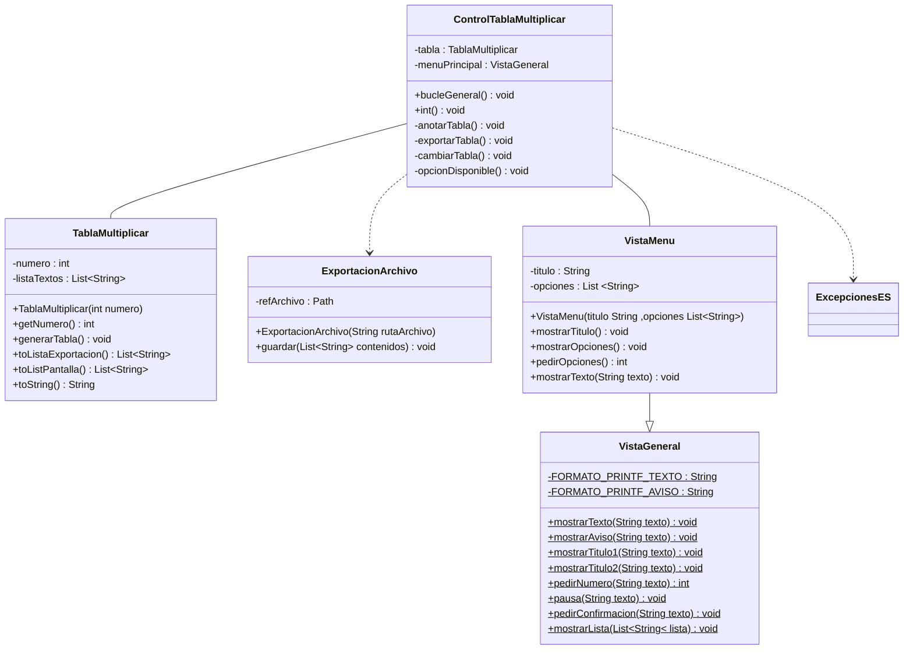

```mermaid
classDiagram
    ControlTablaMultiplicar -- TablaMultiplicar 
    ControlTablaMultiplicar ..> ExportacionArchivo 
    ControlTablaMultiplicar -- VistaMenu
    ControlTablaMultiplicar ..> ExcepcionesES
    VistaMenu --|> VistaGeneral

    class ControlTablaMultiplicar{
        -tabla : TablaMultiplicar
        -menuPrincipal : VistaGeneral
        +bucleGeneral() void
        +int() void
		-anotarTabla() void
        -exportarTabla() void
        -cambiarTabla() void
        -opcionDisponible() void
    }

    class TablaMultiplicar{
        -numero : int
        -listaTextos : List~String~
        +TablaMultiplicar(int numero)
        +getNumero() int
        +generarTabla() void
        +toListaExportacion() List&lt;String&gt;
        +toListPantalla() List&lt;String&gt;
        +toString() String
    }

    class ExportacionArchivo {
        -refArchivo : Path
        +ExportacionArchivo(String rutaArchivo)
        +guardar(List&lt;String&gt; contenidos) void
    }

    class VistaMenu{
        -titulo : String
        -opciones : List ~String~
        +VistaMenu(titulo String ,opciones List~String~ )
        +mostrarTitulo() void
        +mostrarOpciones() void
        +pedirOpciones() int
        +mostrarTexto(String texto) void
    }

    class VistaGeneral{
        -FORMATO_PRINTF_TEXTO : String$
        -FORMATO_PRINTF_AVISO : String$
        +mostrarTexto(String texto)$ void
        +mostrarAviso(String texto)$ void
        +mostrarTitulo1(String texto)$ void
        +mostrarTitulo2(String texto)$ void
        +pedirNumero(String texto)$ int
        +pausa(String texto)$ void
        +pedirConfirmacion(String texto)$ void
        +mostrarLista(List&lt;String&lt; lista)$ void
    }
```