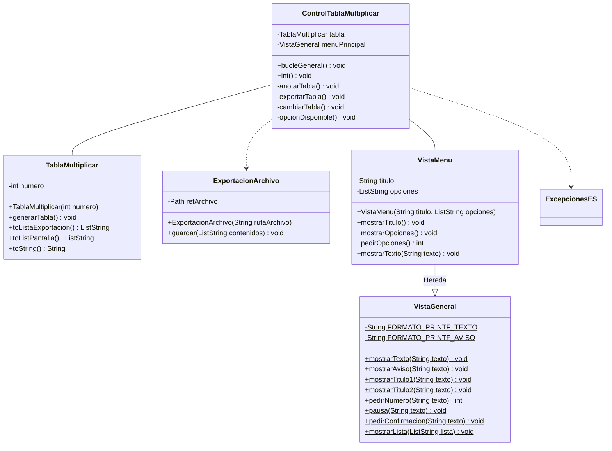

```mermaid
classDiagram
    ControlTablaMultiplicar -- TablaMultiplicar
    ControlTablaMultiplicar ..> ExportacionArchivo
    ControlTablaMultiplicar -- VistaMenu
    ControlTablaMultiplicar ..> ExcepcionesES
    VistaMenu --|> VistaGeneral : Hereda

    class ControlTablaMultiplicar{
        -TablaMultiplicar tabla
        -VistaGeneral menuPrincipal
        +bucleGeneral() void
        +int() void
		-anotarTabla() void
        -exportarTabla() void
        -cambiarTabla() void
        -opcionDisponible() void
    }

    class TablaMultiplicar{
        -int numero
        +TablaMultiplicar(int numero)
        +generarTabla() void
        +toListaExportacion() ListString
        +toListPantalla() ListString
        +toString() String
    }

    class ExportacionArchivo {
        -Path refArchivo
        +ExportacionArchivo(String rutaArchivo)
        +guardar(ListString contenidos) void
    }

    class VistaMenu{
        -String titulo
        -ListString opciones
        +VistaMenu(String titulo, ListString opciones)
        +mostrarTitulo() void
        +mostrarOpciones() void
        +pedirOpciones() int
        +mostrarTexto(String texto) void
    }

    class VistaGeneral{
        -String FORMATO_PRINTF_TEXTO$
        -String FORMATO_PRINTF_AVISO$
        +mostrarTexto(String texto)$ void
        +mostrarAviso(String texto)$ void
        +mostrarTitulo1(String texto)$ void
        +mostrarTitulo2(String texto)$ void
        +pedirNumero(String texto)$ int
        +pausa(String texto)$ void
        +pedirConfirmacion(String texto)$ void
        +mostrarLista(ListString lista)$ void
    }
```